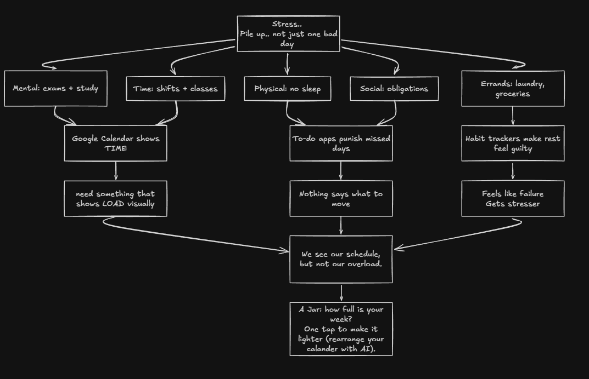
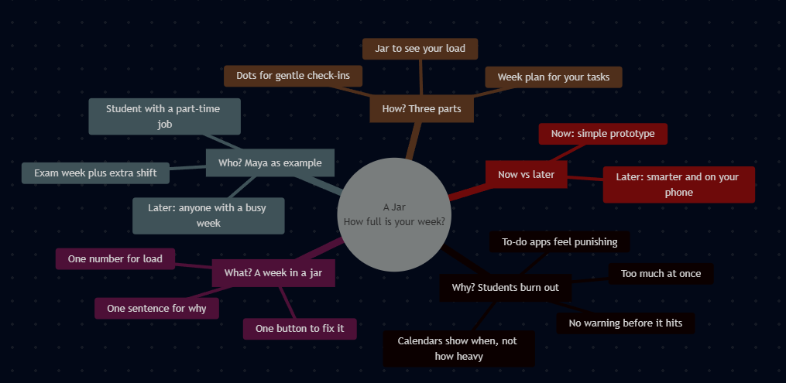
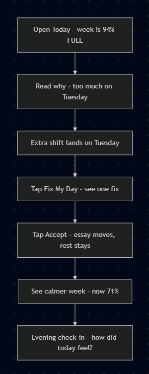
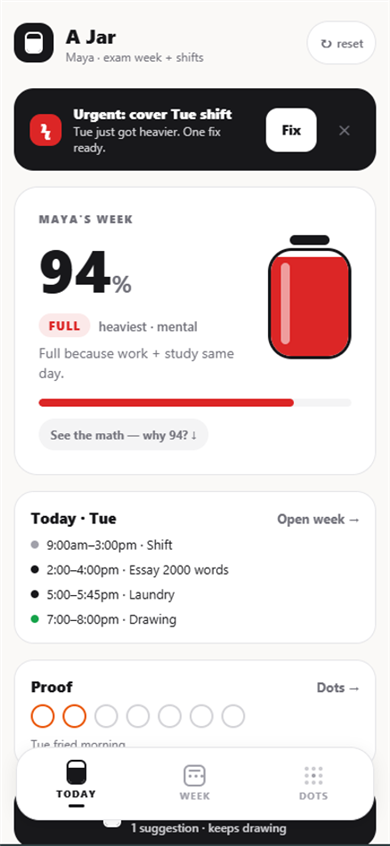
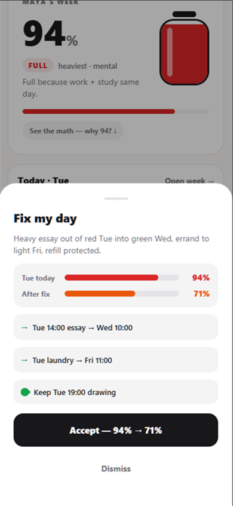
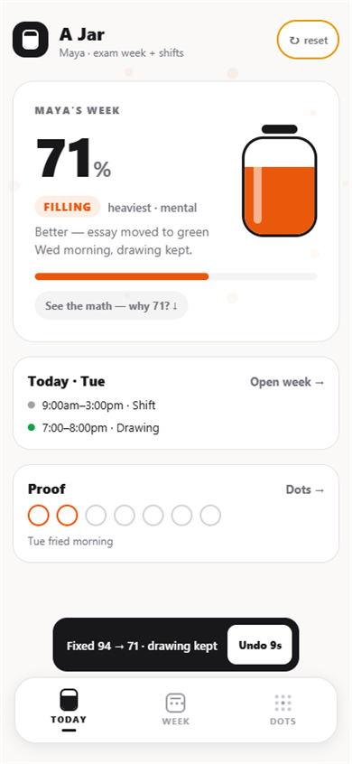
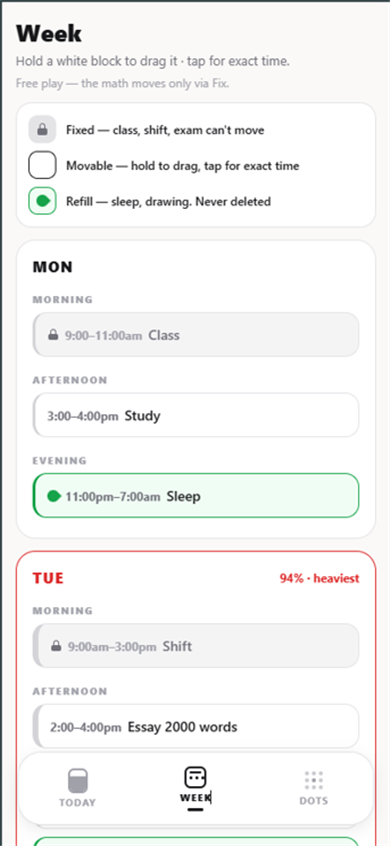
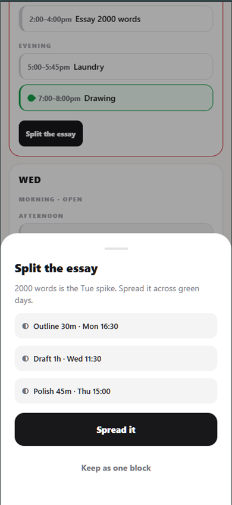
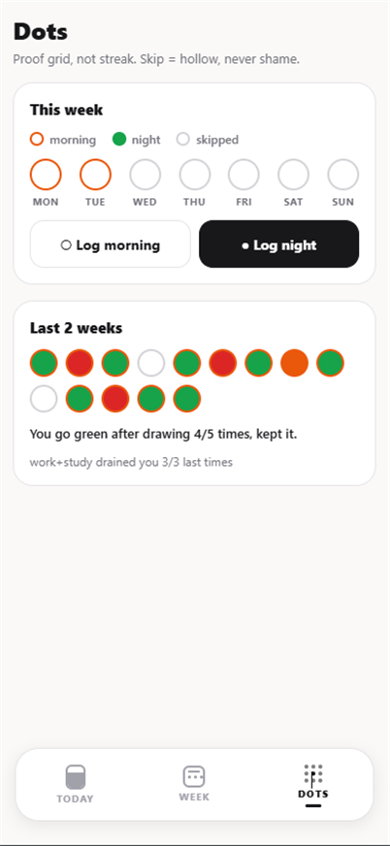

# A Jar by group1

By:
GOH WEI JING &
DANIEL LIM CABREROS

Problem Statement: Stress & Workload Manager

Video Presentation: [TODO: Unlisted Youtube Link]

Presentation Slides: https://mmuedumy-my.sharepoint.com/:p:/g/personal/goh_wei_jing_student_mmu_edu_my/IQBZvKudRaWRQ5WnbKnbwcbdARmegJ0MbKAAjU9Ewp7q2MY?e=2H0N9c

Prototype Link: https://a-jar.vercel.app/

---

## 1. Project Overview

### The Problem

Students carry five loads at once — mental (exams, study), time (shifts, classes),
physical (no sleep), social (obligations), and errands (laundry, groceries).
Burnout is the pile-up, not one bad day. The stakeholders are working students
like Maya, our V1 persona, who juggles exam week with part-time shifts.

Similar apps fall short: **Google Calendar** shows _time_ — where to be — but
nothing shows _load_, i.e. whether you will survive being there. **To-do apps**
(Todoist, TickTick) list tasks but shame you with streaks and red overdue counts
instead of showing which part of your week is full or what to move. **Habit
trackers** reward unbroken streaks, so rest feels guilty. Nothing answers the
real question: _how full is my week, and what single move fixes it?_

### Our Solution

A Jar visualizes your week as a vessel: a single fullness percentage, the
heaviest load type, and the reason in one sentence. When life breaks the plan —
an urgent shift cover lands on an exam-week Tuesday — one tap proposes a single
fix (move the heavy essay to a green Wednesday, push laundry to a light Friday,
keep drawing), and accepting it drops the jar from 94% to 71%. Morning/night
dots collect proof of what drains and refills you, never streaks, never shame.

Feature set:

- **Weekly jar** — fullness % (capped at 115%, purple when overflowing), state
  (filling / full / overflowing), heaviest load, why-sentence, expandable math receipt
- **Week planner** — Mon–Sun with three block kinds: locked (class/shift/exam,
  immovable), movable (study/errands, tap-to-move), refill (sleep/hobbies, green,
  never deleted)
- **Fix My Day** — one pre-computed suggestion + reason + Accept, with 10-second Undo
- **Split** — oversized blocks spread across green days (e.g. essay → outline Mon,
  draft Wed, polish Thu)
- **Dots proof grid** — morning ring / night fill per day plus 2-week history;
  skip = hollow, with captions surfacing learned patterns
- **Morning/night logger** — chip-based check-in (no typing, no shame)

---

## 2. Ideation & Process

### 2.1 Ideas We Considered

Ordered with chosen ideas first:

| Idea                                          | Why it was dropped / kept                                                                |
| --------------------------------------------- | ---------------------------------------------------------------------------------------- |
| **A (Chosen): A Jar — checker + one-tap fix** | Kept. Smallest build carrying the full story: see fullness → accept one fix.             |
| **B (Chosen): Expo cross-platform build**     | Kept. We do expo web for now and convert to apk and ios app later. Easier cross platform |
| C: Chat-based fixer MVP                       | Dropped. Contradicts the one-tap promise; adds friction, typing, and demo risk.          |
| D: Streak-based tracking (Duolingo-style)     | Dropped. Streaks shame rest days; locked proof-grid instead where skip = hollow.         |
| E: Telegram bot stress manager                | Dropped. Can''t show full story                                                          |
| F: Native Android (Kotlin)                    | Dropped. Full rewrite per platform.                                                      |

Items scheduled for Phase 2 (Proper design, APK, and proper backend setup)

### 2.2 How the Idea Evolved

The core never changed: see how full your week is, fix it in one tap. What changed was scope:

- **Who:** everyone → Maya (working student, exam week + shifts). One person makes the demo concrete.
- **Tracking:** streaks → gentle dots. Missed days show as hollow, never shame.
- **Math:** real learning → hardcoded 94% → 71%. Fake brains prove the tap; real math is Phase 2.
- **Moving tasks:** finger-drag → tap-to-drop. Same story, zero demo risk.
- **Platform:** web / Telegram bot / native Kotlin → Expo. One codebase, web now, phone app later.
- **Look:** generated UI → hand-built Expo → polish pass. Same screens, higher craft.

### 2.3 Ideation Boards

_Problem tree: burnout as a five-load pile-up; calendars show time, to-dos shame,
rest feels guilty — nothing shows load. The gap funnels into the jar insight._

_Mindmap: why students burn out, what the jar is (one number + one sentence + one fix), who Maya is, how it works, now vs later._

_User flow: open Today at 94% → read why → extra shift lands → Fix My Day → Accept → calmer 71% → evening check-in._

### 2.4 Mentor Consultation

| Date              | Mentor        | Feedback Received                                                                                                                                                                                                                                                                                    | What Was Changed                                                 |
| ----------------- | ------------- | ---------------------------------------------------------------------------------------------------------------------------------------------------------------------------------------------------------------------------------------------------------------------------------------------------- | ---------------------------------------------------------------- |
| 13 September 2026 | Jia Quan Khor | Jia Quan told us on how to explain our presentationn properly, letting the judges know our ideas and how to make things interesting. He also let us know how the ideas is the most important thing in a Hackathon presentation. The architecture of the idea is crucial in a hackathon presentation. | Made our presentation more interesting by implementing his idea. |

---

## 3. Design & Prototype

UI Prototype: https://a-jar.vercel.app/

_Cold load: 94% FULL, heaviest mental, why-sentence. Tapping the card expands the
math receipt (2h study = 40, 6h shift = 30, −drawing, fried yesterday)._

_Bottom sheet: reason plus before/after bars (94% red → 71% orange), the two
moves, the kept refill. Accept is the single primary action._

_After Accept: number tweens 94→71 with a liquid splash, banner gone, essay on
Wed, laundry on Fri, drawing kept, Undo pill counting down from 10s._

_Legend (fixed / movable / refill) on top; Tue flagged red with the Split button
on the essay; dashed green slots glow while a block is picked up._

_Essay spreads to outline Mon, draft Wed, polish Thu — one "Spread it" tap._

_Legend (ring = morning, fill = night, hollow = skipped), live week with
morning/night log buttons, 2-week history with proof captions._

---

## 4. What Makes It Different

- **Capacity, not scheduling.** The jar answers "can I take this?" — calendars only answer "when is it?" No existing tool visualizes weekly load as one number.
- **Rest as infrastructure.** Refill blocks (sleep, drawing) are green, protected,
  never deletable — recovery is load-bearing, not leftover time. The Fix planner
  works _around_ rest instead of eating it.
- **Proof, not streak.** Dots deliberately reject Duolingo mechanics: skip renders
  hollow with zero penalty, and captions surface learned patterns
  ("work+study drained you 3/3 last times") instead of guilt.
- **One collision, one fix.** The whole product is demonstrated through a single
  overloaded Tuesday and a single accepting tap — a before/after no dashboard of
  charts can match.

How we compare:

|                | Google Calendar | To-do apps    | A Jar                   |
| -------------- | --------------- | ------------- | ----------------------- |
| Shows time     | Yes             | Partial       | Via planner             |
| Shows load     | No              | No            | **Yes — one %**         |
| Suggests a fix | No              | No            | **Yes — one tap**       |
| Protects rest  | No              | No            | **Yes — refill blocks** |
| Shames skips   | N/A             | Yes (streaks) | **No — proof grid**     |

---

## 5. Technical Architecture & Feasibility

### Tech stack

| Layer               | Choice                                         | Why + constraints                                                                                  |
| ------------------- | ---------------------------------------------- | -------------------------------------------------------------------------------------------------- |
| Frontend            | Expo SDK 52, React Native, TypeScript          | One codebase → web demo now, APK via EAS later. Constraint: SDK-pinned deps (react-native 0.76.x). |
| State               | `useState` only, no store                      | Prototype needs no backend/sync; refresh may reset (allowed).                                      |
| Styling             | Plain `StyleSheet`, zero UI deps               | Nothing to break on stage; icons are hand-drawn for dependency-free web bundling.                  |
| Animation           | Built-in Animated API                          | Transform + opacity only, no libraries.                                                            |
| Data                | Hardcoded Maya week, fake 94→71                | Disclosed prototype strategy: fake brains prove the interaction; real math is Phase 2.             |
| Backend / DB / APIs | None                                           | Offline-first: no server costs, no keys, no network needed live.                                   |
| Hosting (prototype) | Static `dist/` (expo export) on Netlify/Vercel | Free static hosting; constraint: web-only until EAS APK in Phase 2.                                |

Offline single-app with no services: the data flow is `data/maya.ts` →
`state/useJar.ts` → three tab screens + sheets.

### Build plan & scope

- **Phase 1 (this submission, frozen):** 3 tabs (Today / Week / Dots), 3 sheets
  (Fix / Split / Logger), scripted 94→71, Undo, toasts, public web link.
- **Explicitly cut:** drag gestures, persistence, notifications, auth, sync,
  backend, Play release, analytics, real jar math — parked with a promotion rule
  (5 hallway users accept Fix first).
- **Phase 2 (3-week building phase):** real jar sum from block weights, learned
  combo receipts from dots, SQLite persistence, EAS Android APK, local
  morning/night reminders. Same UI — no rebuild.
